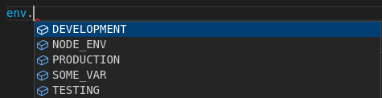

# sensenv

The purpose of this module is to parse the `process.env` object and create an `env` JS object with intellisense on the required env variables, env value getter interface and useful error messages if missing environment variables.

---

## Installation

To install the module add it to the dependencies:

```
npm install sensenv
```

## Usage

Import the module through the name `sensenv`

* CommonJS

```js
const {
    getEnv,
    required
} = require("sensenv");
```

* ES6

```js
import {
    getEnv,
    required
} from "sensenv";
```

Then create the object that gets the required variables:

If the environment variables are:

```
SOME_VAR=some_value
```

```js
const env = getEnv({
    SOME_VAR: required
});

console.log(env.SOME_VAR) // Logs "some_value"
```



---
---

## API

```js
const env = getEnv(envSourceObject, envVariableGetter)
```

---

### env

The JS object with the desired env variables and values.

This object also include the variables:
| Variable      | Description   |
| ------------- | ------------- |
| NODE_ENV      | With the value of `process.env.NODE_ENV` |
| DEVELOPMENT   | If `NODE_ENV` === "development"   |
| PRODUCTION    | If `NODE_ENV` === "production"    |
| TESTING       | If `NODE_ENV` === "test"  |

* Example:  

If the environment variables are:

```
NODE_ENV=development
```

```js
const env = getEnv({});

console.log(env);
/**
 * Logs {
 *      NODE_ENV: "development"
 *      DEVELOPMENT: true
 *      PRODUCTION: false
 *      TESTING: false
 * }
 * */
```

---

### envSourceObject

A JS object with the desired variables as keys, and a *default value* in case the environment variable is missing.

If the *default value* is the `required` export, the function to throw an exception listing all required missing environment variables.

* Example:

If the environment variables are:

```
SOME_VAR_1=value_one
SOME_VAR_2=value_two
```

```js
const env = getEnv({
    SOME_VAR_1: required,
    SOME_VAR_2: required,
    SOME_VAR_3: null,
    SOME_VAR_4: undefined,
    SOME_VAR_5: "some_default_string",
});

console.log(env.SOME_VAR_1) // "value_one"
console.log(env.SOME_VAR_2) // "value_two"
console.log(env.SOME_VAR_3) // "null"
console.log(env.SOME_VAR_4) // "undefined"
console.log(env.SOME_VAR_5) // "some_default_string"
```

If we **don't give the required env variables** in this case, it will throw an exception with the message:

 `Missing environment variables: SOME_VAR_1, SOME_VAR_2`

---

### envVariableGetter

An optional function that gets a **fallback** value in case the environment variables is not present directly in the `process.env` object, and has the following type:

```ts
const envVariableGetter = (name: string) => value
```

* Example:

If the environment variables are:

```
SOME_VAR_1=some_value_1
```

```js
const defaultHolder = {
    SOME_VAR_1: "holder_value_1",
    SOME_VAR_2: "holder_value_2",
}

const envVariableGetter = (name) => defaultHolder[name];

const env = getEnv({
    SOME_VAR_1: required,
    SOME_VAR_2: required,
}, envVariableGetter);

console.log(env.SOME_VAR_1) // "some_value_1"
console.log(env.SOME_VAR_2) // "holder_value_2"
```

**Be careful, as the `envVariableGetter` will not override an already present value in the `process.env` object**

One of the use cases is if you are working with [Create React App](https://create-react-app.dev/), where you need your environment variables to be named with the prefix `REACT_APP_` .

Then you can use `envVariableGetter` to check for the variable with the proper prefix and you can use it like it is not using the prefix (as long as you are not looking for some variable that is already present in the environemnt with the given name):

If the environment variables are:

```
REACT_APP_SOME_VAR=some_value
```

```js
const envVariableGetter = (name) => process.env[`REACT_APP_${name}`];

const env = getEnv({
    SOME_VAR: required,
}, envVariableGetter);

console.log(env.SOME_VAR) // "some_value"
```

In this case `process.env.SOME_VAR` is undefined, but `process.env.REACT_APP_SOME_VAR` is present, and parsed correctly.

#### Typescript

If you need the type of this function, it is also exported from the module:

```ts
import { getEnv, required, EnvVarGetter } from "../lib";

const envVariableGetter: EnvVarGetter = (name) => process.env[`TYPES_${name}`];

const env = getEnv({
    SOME_VAR: required,
}, envVariableGetter);

console.log(env.SOME_VAR) // "some_value"
```
